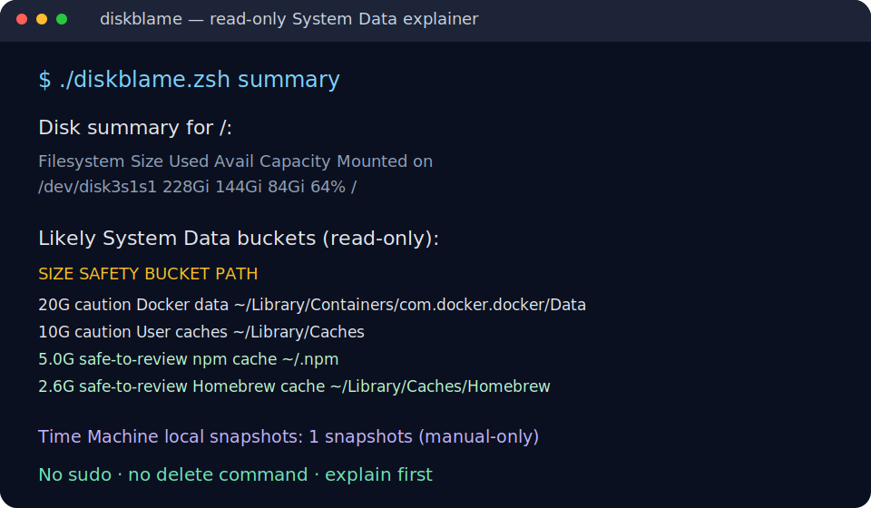

# diskblame

<p align="center">
  
</p>

<p align="center">
  <a href="https://github.com/00xmorty/diskblame/actions/workflows/ci.yml"></a>
  <a href="https://github.com/00xmorty/diskblame/releases/tag/v0.1.0"></a>
  <a href="LICENSE"></a>
  
  
</p>

<p align="center">
  A tiny, read-only macOS CLI that explains likely <strong>“System Data”</strong><br>
  disk usage buckets before you delete anything.
</p>

---

## Why this exists

macOS Storage can show a huge gray **System Data** block without telling you what is inside it. That makes people guess, panic-delete caches, or install aggressive cleanup tools before they understand the problem.

`diskblame` gives you one terminal command that answers:

- How full is my main disk right now?
- Which common macOS buckets are likely contributing to “System Data”?
- Is this bucket usually safe to review, caution-worthy, or manual-only?
- Where should I inspect manually before deleting anything?

It is intentionally conservative: no sudo, no cleanup command, no background agent.

## Highlights

- 🧭 Explains likely macOS **System Data** buckets in one terminal view.
- 📦 Checks Xcode leftovers, iOS backups, caches, logs, Homebrew/npm/pnpm/yarn caches, Docker data, and Time Machine snapshots.
- 🛡️ Labels each bucket with `safe-to-review`, `caution`, or `manual-only`.
- 🔒 Read-only by design: no sudo, no delete command, no automatic cleanup.
- 🧰 Uses standard macOS command-line tools.
- 🧪 Ships with smoke tests and macOS GitHub Actions CI.
- 🪶 Single zsh file. Easy to read, copy, audit, and remove.

## Install

Clone and run directly:

```sh
git clone https://github.com/00xmorty/diskblame.git
cd diskblame
chmod +x diskblame.zsh
./diskblame.zsh summary
```

Optional: put it on your `PATH`:

```sh
cp diskblame.zsh /usr/local/bin/diskblame
chmod +x /usr/local/bin/diskblame
diskblame summary
```

No package manager is required for v0.1.0.

## Quick start

```sh
# Full diagnostic view
./diskblame.zsh summary

# Bucket list without the disk header
./diskblame.zsh scan

# Help / version
./diskblame.zsh help
./diskblame.zsh --version
```

## Command reference

### `summary`

Prints a compact disk overview, likely System Data buckets, Time Machine snapshot count, and safety label guidance.

```sh
./diskblame.zsh summary
```

Example:

```text
Disk summary for /:
  Filesystem        Size    Used   Avail Capacity iused ifree %iused  Mounted on
  /dev/disk3s1s1   228Gi    12Gi    84Gi    13%    459k  879M    0%   /

Likely System Data buckets (read-only):
  SIZE     SAFETY          BUCKET                   PATH
  20G      caution         Docker data              /Users/you/Library/Containers/com.docker.docker/Data
  10G      caution         User caches              /Users/you/Library/Caches
  5.0G     safe-to-review  npm cache                /Users/you/.npm
  2.6G     safe-to-review  Homebrew cache           /Users/you/Library/Caches/Homebrew

Time Machine local snapshots: 1 snapshots (manual-only)
```

### `scan`

Lists likely System Data buckets sorted by size, then prints safety guidance.

```sh
./diskblame.zsh scan
```

### `help`

Shows usage and the read-only safety promise.

```sh
./diskblame.zsh help
```

### `--version`

```sh
./diskblame.zsh --version
```

## What it checks

| Bucket | Typical path | Safety label |
| --- | --- | --- |
| Xcode DerivedData | `~/Library/Developer/Xcode/DerivedData` | `safe-to-review` |
| Xcode Archives | `~/Library/Developer/Xcode/Archives` | `safe-to-review` |
| Xcode DeviceSupport | `~/Library/Developer/Xcode/iOS DeviceSupport` | `safe-to-review` |
| iOS backups | `~/Library/Application Support/MobileSync/Backup` | `caution` |
| User caches | `~/Library/Caches` | `caution` |
| User logs | `~/Library/Logs` | `safe-to-review` |
| Homebrew cache | `~/Library/Caches/Homebrew` | `safe-to-review` |
| npm cache | `~/.npm` | `safe-to-review` |
| pnpm store | `~/Library/pnpm/store` | `safe-to-review` |
| yarn cache | `~/Library/Caches/Yarn` | `safe-to-review` |
| Docker data | `~/Library/Containers/com.docker.docker/Data` | `caution` |
| Time Machine local snapshots | reported via `tmutil` | `manual-only` |

## Safety model

`diskblame` is diagnostic-first.

| Behavior | v0.1.0 |
| --- | --- |
| Requires sudo | No |
| Deletes files | No |
| Offers cleanup commands | No |
| Runs a daemon / LaunchAgent | No |
| Inspects file contents | No |
| Reports aggregate directory sizes | Yes |
| Points to manual review paths | Yes |

Safety labels:

- `safe-to-review`: usually generated caches/logs, still inspect before removing manually.
- `caution`: can contain important app/user data; review app docs first.
- `manual-only`: use macOS-supported flows; `diskblame` will not modify it.

If you want a tool that automatically frees disk space, this is not that tool. If you want a small auditable CLI that tells you where to look before you act, this is that tool.

## FAQ

### Does it delete anything?

No. v0.1.0 has no delete command and performs no cleanup.

### Does it require sudo?

No. It uses standard macOS tools and runs as your user.

### Does it run in the background?

No. It is a single zsh script. Nothing remains running after the command exits.

### Why does it say “likely” System Data buckets?

macOS does not expose one clean public breakdown for the Storage UI’s “System Data” category. `diskblame` checks common contributors and shows their sizes so you can inspect them deliberately.

### Can I safely delete everything marked `safe-to-review`?

Do not delete blindly. The label means it is usually generated data, not that every file should be removed. Inspect the path and app-specific docs first.

### Why not use a cleaner app?

Cleaner apps can be useful, but this tool is for the step before cleanup: understanding what is taking space and avoiding destructive guesses.

## Requirements

- macOS
- `zsh`
- Standard macOS tools: `df`, `du`, `awk`, `sort`, `head`
- Optional: `tmutil` for Time Machine local snapshot counts

## Test

```sh
bash tests/test_diskblame.sh
```

The smoke test validates:

- zsh syntax
- help output
- version output
- summary path
- scan path
- unknown-command failure path

## Design principles

1. Explain before acting.
2. Prefer read-only diagnostics over cleanup magic.
3. Never require elevated privileges for basic disk understanding.
4. Make destructive behavior impossible because there is no destructive behavior.
5. Keep the whole tool small enough to audit in one sitting.

## Roadmap

- JSON output for scripting and dashboards.
- Better formatting for long paths.
- Optional threshold filters.
- Homebrew formula if the tool proves useful.
- More tests around missing optional tools and unusual path names.

Non-goals for now:

- Automatic cleanup.
- Background disk monitoring daemon.
- LaunchAgent installer.
- Cross-platform support.
- Replacing Time Machine / Xcode / Docker official cleanup flows.

## Contributing

Issues and small pull requests are welcome. Please keep the safety model intact: read-only, no sudo, no automatic cleanup.

Before opening a PR, run:

```sh
bash tests/test_diskblame.sh
```

## License

MIT
